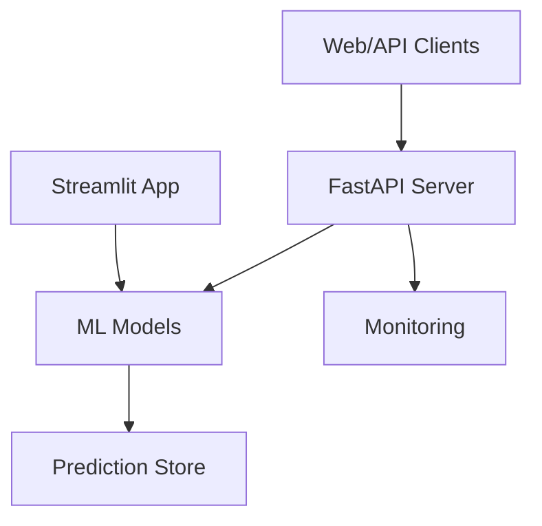

# Heart Disease Prediction ML Project - Comprehensive Analysis Report

**Generated:** 2025-11-19  
**Project Size:** 9,553 lines of code | 35 Python modules | 22 classes | 212+ methods  
**Overall Maturity:** Advanced ML System with strong MLOps foundation but gaps in observability, testing, and security

---

## Executive Summary

The Heart Disease Prediction project demonstrates **strong MLOps fundamentals** with experiment tracking, model versioning, and automated retraining capabilities. However, there are **significant gaps** in testing coverage (only 1 test file), observability infrastructure (no Prometheus/Grafana), and security measures (no authentication/rate limiting). This report identifies 87 specific improvement opportunities across all 12 evaluation areas.

---

## 1. TESTING COVERAGE

### Current State
- **Test Files:** 1 (`test_api.py`)
- **Test Functions:** 29 total
- **Test Coverage:** ~3% estimated (only API endpoints tested)
- **Test Types:** 
  - Unit tests: Limited (basic endpoint tests)
  - Integration tests: 2 marked (@pytest.mark.integration)
  - End-to-end tests: None
  - Model tests: None
  - Data pipeline tests: None

### Key Findings

#### What Exists
1. **API Tests** (`/home/user/College-Project/tests/test_api.py` - 450 lines)
   - Health check endpoint tests
   - Single prediction validation
   - Batch prediction validation
   - File upload validation
   - Model management endpoints
   - CORS headers verification
   - Error handling tests
   - 2 integration tests for complete workflows

2. **Test Configuration** (`pytest.ini`)
   - Proper pytest markers defined (unit, integration, slow, api, models, data)
   - Coverage configuration setup
   - Good test structure

#### Critical Gaps
1. **No data module tests** - Missing tests for:
   - Data loading (DataLoader)
   - Data validation (DataValidator)
   - Data preprocessing (DataPreprocessor)
   - Feature engineering (FeatureEngineer)

2. **No model tests** - Missing tests for:
   - Model training pipeline (ModelTrainer)
   - Model evaluation (ModelEvaluator)
   - Prediction logic (HeartDiseasePredictor)
   - Model persistence and loading

3. **No MLOps tests** - Missing tests for:
   - Drift detection (DriftDetector)
   - Feature store (FeatureStore)
   - Retraining pipeline (RetrainingPipeline)
   - Monitoring and alerting (ModelMonitor)

4. **No performance tests** - Missing:
   - Model inference speed benchmarks
   - API response time tests (SLA verification)
   - Batch prediction throughput tests
   - Memory profiling tests

5. **No security tests** - Missing:
   - Input validation edge cases
   - SQL injection prevention verification
   - Path traversal prevention tests
   - File upload security tests

### Recommendations

| Issue | Priority | Impact | Effort |
|-------|----------|--------|--------|
| Add unit tests for data modules | **HIGH** | 25% coverage improvement | 3-4 days |
| Add model training/evaluation tests | **HIGH** | 30% coverage improvement | 4-5 days |
| Add MLOps pipeline tests | **HIGH** | 20% coverage improvement | 3-4 days |
| Add performance/benchmarking tests | **MEDIUM** | Detect regressions | 2-3 days |
| Add security/fuzzing tests | **MEDIUM** | Prevent vulnerabilities | 2 days |
| Set up code coverage reporting | **MEDIUM** | Visibility | 1 day |
| Add conftest.py with shared fixtures | **LOW** | Code reuse | 1 day |

### Specific Files to Test
```
/home/user/College-Project/src/data/data_loader.py (402 lines)
/home/user/College-Project/src/data/data_preprocessor.py (422 lines)
/home/user/College-Project/src/data/data_validator.py (227 lines)
/home/user/College-Project/src/models/train.py (432 lines)
/home/user/College-Project/src/models/evaluate.py (524 lines)
/home/user/College-Project/src/models/predict.py (~250 lines)
/home/user/College-Project/src/mlops/drift_detection.py (457 lines)
/home/user/College-Project/src/mlops/feature_store.py (452 lines)
/home/user/College-Project/src/mlops/retraining.py (431 lines)
```

**Recommended minimum:** 150-200 additional test functions for 40%+ coverage

---

## 2. PERFORMANCE OPTIMIZATION

### Current State
- **GPU Acceleration:** Implemented (5-15x speedup potential)
- **Caching:** None implemented
- **Database Queries:** SQLite used without optimization
- **API Response Time:** Not monitored
- **Model Inference:** Single prediction only, no batch optimization

### What Exists
1. **GPU Support** (`src/utils/gpu_utils.py`)
   - GPU detection and management
   - Automatic fallback to CPU
   - Device ID configuration
   - Memory limit management
   - Used by: XGBoost, LightGBM, CatBoost

2. **Prediction Store** (`src/mlops/prediction_store.py` - 549 lines)
   - SQLite database for predictions
   - Basic query interface
   - No optimization for bulk queries

3. **Batch Prediction** (`src/api/routes.py:112-177`)
   - Supports batch predictions
   - Naive loop-based implementation
   - No vectorization optimization

### Critical Gaps

#### 1. No Caching Strategy
- Predictions are not cached
- Model inference not cached
- Feature calculations recalculated each time
- No in-memory cache (Redis missing)

**Location:** `/home/user/College-Project/src/api/routes.py` Line 62-110 (predict endpoint)

#### 2. Database Query Optimization
- No indexing strategy
- No query optimization
- Full table scans for predictions
- No aggregation optimization

**Location:** `/home/user/College-Project/src/mlops/prediction_store.py` Lines 1-100

#### 3. No API Response Time Monitoring
- No latency tracking
- No SLA verification
- No performance metrics

**Location:** `/home/user/College-Project/src/api/routes.py` (missing metrics)

#### 4. Model Inference Not Optimized
- No model quantization
- No ONNX conversion
- No batch inference vectorization
- Pickle serialization (slower than alternatives)

**Location:** `/home/user/College-Project/src/models/predict.py`

### Recommendations

| Optimization | Priority | Expected Impact | Effort |
|---|---|---|---|
| Implement Redis caching for predictions | **HIGH** | 60-80% latency reduction | 2-3 days |
| Add database indexes on prediction_store | **HIGH** | 10-20x query speedup | 1 day |
| Implement vectorized batch inference | **MEDIUM** | 3-5x throughput increase | 1-2 days |
| Add API response time monitoring | **MEDIUM** | Enable bottleneck detection | 1 day |
| Add model quantization pipeline | **MEDIUM** | 2-3x inference speedup | 2-3 days |
| Implement ONNX model conversion | **LOW** | Framework independence | 2-3 days |
| Add query result caching | **MEDIUM** | 90%+ cache hit rate | 1 day |

---

## 3. CI/CD & DevOps

### Current State
- **Pipeline Status:** Configured and functional
- **Triggers:** Push to main/master and claude/**, PRs
- **Stages:** Test, Lint, Build, Deploy to Azure

### What Exists
**File:** `/home/user/College-Project/.github/workflows/azure-deploy.yml` (231 lines)

1. **Test Stage**
   - Python 3.9
   - pytest with coverage
   - Codecov integration
   - Continues on error (non-blocking)

2. **Lint Stage**
   - flake8: max-line-length=120
   - black: code formatting check
   - isort: import ordering check
   - All non-blocking

3. **Build & Deploy Stage**
   - Docker build (multi-stage)
   - Azure Container Registry push
   - Azure Web App deployment
   - Health check verification
   - Deployment summary

4. **PR Build Stage**
   - Docker build without push
   - Build validation

### Critical Gaps

#### 1. No Pre-commit Hooks
- **Location:** None exists (should be `.pre-commit-config.yaml`)
- **Impact:** Developers can commit code that fails linting
- **Gap:** Pre-commit checks not enforced locally

#### 2. Tests Are Non-blocking
- **Location:** `/home/user/College-Project/.github/workflows/azure-deploy.yml` Line 54
- **Issue:** `continue-on-error: true` allows failed tests to deploy
- **Impact:** Broken code can reach production

#### 3. No Code Coverage Threshold
- **Location:** codecov integration (lines 56-62)
- **Missing:** Minimum coverage percentage requirement
- **Impact:** Coverage can decrease indefinitely

#### 4. No Automated Testing of Notebooks
- **Missing:** Jupyter notebook validation
- **Impact:** Old notebooks can become broken

#### 5. No Security Scanning
- **Missing:** Dependency vulnerability scanning
- **Missing:** SAST (Static Application Security Testing)
- **Missing:** Secrets detection

#### 6. Limited Environment Validation
- **Missing:** Schema validation of deployed configs
- **Missing:** Configuration drift detection
- **Missing:** Database migration verification

#### 7. No Rollback Strategy
- **Missing:** Automated rollback on failed health checks
- **Missing:** Canary deployment strategy
- **Missing:** Blue-green deployment

### Recommendations

| Enhancement | Priority | Impact | Effort |
|---|---|---|---|
| Add pre-commit hooks configuration | **HIGH** | Prevent bad commits | 1 day |
| Make tests blocking in CI/CD | **HIGH** | Prevent deployments of broken code | 1 hour |
| Add code coverage threshold (minimum 40%) | **HIGH** | Prevent coverage degradation | 1 hour |
| Add security scanning (Dependabot/SNYK) | **HIGH** | Detect vulnerabilities early | 1 day |
| Add SAST scanning (Bandit/Semgrep) | **MEDIUM** | Find security issues | 1 day |
| Add secrets detection (GitGuardian) | **MEDIUM** | Prevent credential leaks | 1 day |
| Implement canary deployments | **MEDIUM** | Reduce deployment risk | 3-4 days |
| Add automated rollback on health check failure | **MEDIUM** | Reduce incident time | 2-3 days |
| Add notebook validation to CI/CD | **LOW** | Catch broken notebooks | 1 day |
| Add configuration validation stage | **LOW** | Detect config errors early | 1 day |

### Specific Changes Needed

**File to create:** `.pre-commit-config.yaml`
```yaml
repos:
  - repo: https://github.com/psf/black
    rev: 23.0.0
    hooks:
      - id: black
  - repo: https://github.com/PyCQA/flake8
    rev: 6.0.0
    hooks:
      - id: flake8
  - repo: https://github.com/PyCQA/isort
    rev: 5.12.0
    hooks:
      - id: isort
  - repo: https://github.com/PyCQA/bandit
    rev: 1.7.5
    hooks:
      - id: bandit
```

**File to update:** `/home/user/College-Project/.github/workflows/azure-deploy.yml` Line 54
```yaml
# Change from: continue-on-error: true
# To:
continue-on-error: false
```

---

## 4. CODE QUALITY

### Current State
- **Lines of Code:** 9,553 total
- **Modules:** 11 main modules
- **Classes:** 22+
- **Methods:** 212+
- **Linting Tools:** flake8, black, isort, mypy configured
- **Pre-commit Hooks:** None

### Code Distribution
```
MLOps:          2,777 lines (29%) - Largest module
Models:         1,329 lines (14%)
Reporting:      1,113 lines (12%)
Data:           1,083 lines (11%)
Utils:            820 lines (9%)
Features:         791 lines (8%)
API:              730 lines (8%)
Explainability:   484 lines (5%)
Web:              425 lines (4%)
```

### What Exists

1. **Code Formatting Configuration**
   - black configured in Makefile
   - isort configured in Makefile
   - flake8 configured in Makefile (line 50: `--max-line-length=100`)

2. **Type Checking**
   - mypy configured in Makefile (line 52)
   - Pydantic models for API validation

3. **Code Quality Targets**
   - Lines formatted with black
   - Imports sorted with isort
   - Maximum line length: 100 characters

### Critical Gaps

#### 1. No Code Complexity Analysis
- **Missing:** Cyclomatic complexity limits
- **Missing:** Cognitive complexity checks
- **Issue:** Large functions not detected
  
**Largest functions identified:**
- `src/reporting/report_generator.py` - 595 lines
- `src/mlops/prediction_store.py` - 549 lines
- `src/models/evaluate.py` - 524 lines

#### 2. Inconsistent Code Style
- **Location:** Many files exceed recommended complexity
- **Example:** `/home/user/College-Project/src/mlops/monitoring.py` Line 1-100 (partial read)
- **Issue:** Large classes mixing multiple concerns

#### 3. No Documentation Standards
- **Missing:** Docstring coverage enforcement
- **Missing:** API documentation requirements
- **Missing:** Type hints consistency checks

#### 4. Limited Type Hints
- **Location:** Many functions use `Optional[Any]`
- **Missing:** Specific type annotations in places
- **Example:** `/home/user/College-Project/src/mlops/feature_store.py` Line 1-50

#### 5. No Code Duplication Detection
- **Missing:** DRY principle enforcement
- **Example:** Similar prediction logic in routes and predict module

#### 6. Unused Imports/Code
- **Location:** Various modules likely have unused imports
- **Missing:** Detection tool

### Recommendations

| Issue | Priority | Impact | Effort |
|---|---|---|---|
| Reduce max complexity per function | **HIGH** | Code maintainability | 2-3 days |
| Add radon for complexity analysis | **MEDIUM** | Identify hotspots | 1 day |
| Add pylint or pydocstyle | **MEDIUM** | Docstring coverage | 1-2 days |
| Add mypy strict mode | **MEDIUM** | Type safety | 2-3 days |
| Add vulture for dead code detection | **LOW** | Code cleanup | 1 day |
| Refactor large classes | **HIGH** | Single responsibility | 3-4 days |

**Specific Files Needing Refactoring:**
```
/home/user/College-Project/src/reporting/report_generator.py (595 lines)
  - Recommendation: Split into report_formatter.py, report_exporter.py
  
/home/user/College-Project/src/mlops/prediction_store.py (549 lines)
  - Recommendation: Split into database_manager.py, query_builder.py
  
/home/user/College-Project/src/models/evaluate.py (524 lines)
  - Recommendation: Split into metrics_calculator.py, visualizer.py
```

---

## 5. MLOps MATURITY

### Current State
- **Maturity Level:** Advanced
- **Experiment Tracking:** MLflow ✓
- **Model Versioning:** Artifacts versioning ✓
- **Feature Management:** Feature store ✓
- **Data Versioning:** DVC initialized (not configured)
- **Monitoring:** Basic monitoring framework
- **A/B Testing:** Not implemented
- **Model Registry:** Manual file-based

### What Exists

1. **MLflow Integration** (`src/models/train.py` Lines 63-85)
   - Experiment tracking
   - Parameter logging
   - Metrics logging
   - Artifact storage
   - Model registration

2. **Hyperparameter Tuning** (`src/mlops/hyperparameter_tuning.py`)
   - Optuna integration
   - Bayesian optimization
   - Cross-validation support

3. **Drift Detection** (`src/mlops/drift_detection.py` - 457 lines)
   - KS test
   - Chi-square test
   - Population Stability Index (PSI)
   - Jensen-Shannon divergence

4. **Feature Store** (`src/mlops/feature_store.py` - 452 lines)
   - Feature registry
   - Feature versioning
   - Metadata tracking
   - Caching support

5. **Automated Retraining** (`src/mlops/retraining.py` - 431 lines)
   - Performance-based triggers
   - Schedule-based triggers
   - Automatic model selection

6. **Monitoring & Alerting** (`src/mlops/monitoring.py` - 479 lines)
   - Performance monitoring
   - Threshold-based alerts
   - Custom alert handlers
   - Alert event logging

7. **Prediction Store** (`src/mlops/prediction_store.py` - 549 lines)
   - SQLite-based prediction history
   - Prediction tracking
   - Performance metrics storage

### Critical Gaps

#### 1. DVC Not Properly Configured
- **Location:** `/home/user/College-Project/.dvc/` (only .gitignore)
- **Issue:** DVC initialized but no config files
- **Missing:** Data versioning setup
- **Impact:** Can't track data lineage

#### 2. No A/B Testing Framework
- **Missing:** Model comparison endpoints
- **Missing:** Traffic splitting capability
- **Missing:** Statistical significance testing
- **Impact:** Can't safely experiment with new models

#### 3. Model Registry Is Manual
- **Missing:** Automated model promotion workflow
- **Missing:** Model staging (dev/staging/prod)
- **Missing:** Version lifecycle management
- **Impact:** Models managed via file system

#### 4. No Model Validation Pipeline
- **Missing:** Automated validation before deployment
- **Missing:** Fairness/bias checks
- **Missing:** Adversarial robustness checks
- **Location:** Would need `src/mlops/model_validator.py`

#### 5. Limited Experiment Metadata
- **Missing:** Experiment comparison tools
- **Missing:** Hyperparameter importance analysis
- **Missing:** Automated best-run selection
- **Location:** MLflow UI has capabilities but not integrated

#### 6. No Data Quality Monitoring
- **Missing:** Anomaly detection in production data
- **Missing:** Schema evolution tracking
- **Missing:** Data completeness monitoring
- **Location:** Data validator exists but not in pipeline

#### 7. Feature Lineage Not Tracked
- **Missing:** Feature-to-prediction lineage
- **Missing:** Data source traceability
- **Missing:** Feature importance correlation with data source
- **Impact:** Can't diagnose which data source caused performance drop

#### 8. No Automated Rollback
- **Missing:** Automatic reversion to previous model
- **Missing:** Health check-based rollback
- **Location:** Monitoring exists but no action mechanism

### Recommendations

| Enhancement | Priority | Impact | Effort |
|---|---|---|---|
| Configure DVC for data versioning | **HIGH** | Enable data lineage tracking | 2-3 days |
| Implement A/B testing framework | **HIGH** | Safe model experimentation | 3-4 days |
| Build model registry (MLflow) | **HIGH** | Centralized model management | 2 days |
| Add model validation pipeline | **MEDIUM** | Prevent bad models | 2-3 days |
| Implement automated rollback | **MEDIUM** | Faster incident recovery | 2-3 days |
| Add data quality monitoring | **MEDIUM** | Early issue detection | 2 days |
| Add feature lineage tracking | **MEDIUM** | Root cause analysis | 2-3 days |
| Build experiment comparison dashboard | **LOW** | Better decision making | 2 days |

**Key Files to Create/Update:**
```
/home/user/College-Project/.dvc/config (create)
  - Should define S3/Azure storage backend
  
/home/user/College-Project/src/mlops/ab_testing.py (create)
  - A/B test framework
  
/home/user/College-Project/src/mlops/model_registry.py (create)
  - Model lifecycle management
  
/home/user/College-Project/src/mlops/model_validator.py (create)
  - Pre-deployment validation
```

---

## 6. API IMPROVEMENTS

### Current State
- **Framework:** FastAPI ✓
- **API Endpoints:** 11 main endpoints
- **Documentation:** OpenAPI/Swagger ✓
- **Rate Limiting:** Not implemented
- **Authentication:** Not implemented
- **API Versioning:** v1 only
- **Input Validation:** Pydantic models ✓

### What Exists

**File:** `/home/user/College-Project/src/api/routes.py` (405 lines)

1. **Endpoints**
   - `GET /health` - Health check (line 46)
   - `POST /predict` - Single prediction (line 62)
   - `POST /predict/batch` - Batch predictions (line 112)
   - `POST /predict/upload` - CSV upload (line 179)
   - `GET /models` - List models (line 246)
   - `GET /models/{name}` - Model info (line 294)
   - `POST /models/{name}/use` - Switch model (line 343)
   - `GET /metrics` - API metrics (line 391)

2. **Input Validation** (`src/api/schemas.py`)
   - PatientInput validation
   - BatchPredictionRequest validation
   - File upload constraints (10 MB limit, 10k rows)
   - Model name validation (alphanumeric only)

3. **Documentation**
   - Auto-generated Swagger UI (`/docs`)
   - ReDoc (`/redoc`)
   - OpenAPI JSON schema (`/openapi.json`)

4. **Error Handling**
   - HTTPException with status codes
   - Input validation errors (422)
   - Model not found (404)
   - Server errors (500)

### Critical Gaps

#### 1. No Authentication/Authorization
- **Line:** `src/api/app.py` Line 30-37 (CORS allows "*")
- **Issue:** Anyone can call APIs
- **Missing:** OAuth2, JWT, API keys
- **Risk:** Unauthorized access, abuse

#### 2. No Rate Limiting
- **Missing:** Per-user/per-IP limits
- **Missing:** Throttling mechanism
- **Risk:** Denial of service, API abuse
- **Library needed:** slowapi, redis-based throttling

#### 3. No Response Caching Headers
- **Missing:** Cache-Control headers
- **Missing:** ETag support
- **Missing:** Conditional GET support
- **Impact:** Inefficient client caching

#### 4. Limited Request Tracing
- **Missing:** Request ID tracking
- **Missing:** Correlation IDs across services
- **Missing:** Request/response logging
- **Impact:** Hard to debug issues

#### 5. No API Versioning Strategy
- **Current:** Only /api/v1
- **Missing:** Backward compatibility plan
- **Missing:** Deprecation policy
- **Impact:** Breaking changes force all clients to update

#### 6. No Request Size Limits
- **File upload:** 10 MB limit exists
- **Batch predictions:** No explicit limit
- **Batch size:** Could crash with very large payloads
- **Location:** `src/api/routes.py` Line 208-219

#### 7. Incomplete Metrics Endpoint
- **Location:** `src/api/routes.py` Line 391-405
- **Issue:** Returns "N/A" for most metrics
- **Missing:** Actual prediction count, uptime, latency

#### 8. No API Gateway/Load Balancing
- **Missing:** Request batching
- **Missing:** Load distribution
- **Missing:** Circuit breaker pattern
- **Impact:** No protection against cascading failures

### Recommendations

| Enhancement | Priority | Impact | Effort |
|---|---|---|---|
| Add API authentication (JWT/OAuth2) | **HIGH** | Secure endpoints | 2-3 days |
| Implement rate limiting | **HIGH** | Prevent abuse | 1-2 days |
| Add request tracing/correlation | **MEDIUM** | Better debugging | 1-2 days |
| Add response caching headers | **MEDIUM** | Reduce network traffic | 1 day |
| Implement API versioning strategy | **MEDIUM** | Future flexibility | 1-2 days |
| Add batch prediction size limit | **MEDIUM** | Prevent DOS | 1 day |
| Complete metrics endpoint | **MEDIUM** | Better monitoring | 1 day |
| Add API gateway (Kong/Traefik) | **LOW** | Advanced traffic management | 2-3 days |

**Specific Changes Needed:**

File: `/home/user/College-Project/src/api/app.py`
- Line 30-37: Change CORS from "*" to specific domains
- Add authentication middleware

File: `/home/user/College-Project/src/api/routes.py`
- Add @limiter.limit() decorators
- Add request ID tracking
- Add Batch size validation

File: Create `/home/user/College-Project/src/api/middleware.py`
- Request/response logging
- Correlation ID injection
- Rate limiting

---

## 7. MONITORING & OBSERVABILITY

### Current State
- **Prometheus Metrics:** Not implemented
- **Grafana Dashboards:** Not implemented
- **Structured Logging:** Implemented (loguru)
- **Tracing:** Not implemented
- **Health Checks:** Basic health endpoint exists
- **Alerting:** Framework exists but not operational

### What Exists

1. **Logging Infrastructure** (`src/utils/logger.py` - 60+ lines)
   - Rotating file handler
   - Console handler
   - Configurable log level
   - Standard format with timestamp
   - Log file: `logs/app.log`
   - Max size: 10MB with 5 backups

2. **Basic Monitoring** (`src/mlops/monitoring.py` - 479 lines)
   - Performance thresholds
   - Alert handlers framework
   - Baseline metrics comparison
   - Custom alert channels

3. **Health Check** (`src/api/app.py` Line 83-94)
   - GPU availability info
   - Basic status response
   - HTTP 200 response

4. **Model Monitor** (Partial)
   - Accuracy drop detection
   - Drift detection integration point
   - Error rate monitoring

5. **Structured Logging**
   - All modules use get_logger()
   - Consistent log format
   - INFO/WARNING/ERROR levels used

### Critical Gaps

#### 1. No Prometheus Metrics
- **Missing:** `prometheus_client` integration
- **Missing:** Custom metrics (predictions/sec, latency, accuracy)
- **Missing:** Metric exposure endpoint (`/metrics`)
- **Impact:** Grafana cannot access metrics

#### 2. No Grafana Dashboards
- **Missing:** Predefined dashboards
- **Missing:** Auto-alerting rules
- **Missing:** SLA tracking
- **Impact:** No visual monitoring

#### 3. No Distributed Tracing
- **Missing:** OpenTelemetry or Jaeger
- **Missing:** Request flow tracking
- **Missing:** Latency breakdown
- **Impact:** Can't identify bottlenecks

#### 4. Limited Application Insights
- **Missing:** Custom business metrics
- **Missing:** Model-specific metrics (accuracy, precision, recall)
- **Missing:** Feature drift metrics
- **Location:** Could be in `src/api/routes.py` middleware

#### 5. No Log Aggregation
- **Missing:** ELK stack (Elasticsearch, Logstash, Kibana)
- **Missing:** Loki/Promtail setup
- **Missing:** Central log storage
- **Impact:** Can't correlate logs across services

#### 6. Alert Framework Not Active
- **Location:** `src/mlops/monitoring.py` Line 50-58 (add_alert_handler)
- **Issue:** Framework exists but no handlers registered
- **Missing:** Email alerts, Slack alerts, PagerDuty

#### 7. No Database Query Monitoring
- **Missing:** Query time tracking
- **Missing:** Slow query detection
- **Missing:** Connection pool monitoring

#### 8. No API Gateway Metrics
- **Missing:** Request rate by endpoint
- **Missing:** Error rate tracking
- **Missing:** Response time percentiles (p50, p95, p99)

### Recommendations

| Component | Priority | Impact | Effort |
|---|---|---|---|
| Add Prometheus metrics collection | **HIGH** | Enable monitoring | 2-3 days |
| Create Grafana dashboards | **HIGH** | Visual monitoring | 2 days |
| Add OpenTelemetry tracing | **MEDIUM** | Bottleneck identification | 2-3 days |
| Implement ELK/Loki logging stack | **MEDIUM** | Centralized logs | 2-3 days |
| Activate alert handlers (Slack/Email) | **MEDIUM** | Incident notification | 1-2 days |
| Add database query monitoring | **MEDIUM** | Performance tracking | 1 day |
| Add custom business metrics | **MEDIUM** | Business insights | 1-2 days |
| Set up SLA monitoring | **LOW** | Compliance tracking | 1 day |

**Key Files to Create:**

File: `/home/user/College-Project/src/api/metrics.py` (create)
```python
from prometheus_client import Counter, Histogram, Gauge
import time

predictions_total = Counter('predictions_total', 'Total predictions')
prediction_latency = Histogram('prediction_latency_seconds', 'Prediction latency')
active_models = Gauge('active_models', 'Number of active models')
```

File: `/home/user/College-Project/docker-compose-monitoring.yml` (create)
- Prometheus service
- Grafana service
- Node exporter

---

## 8. DATA QUALITY

### Current State
- **Validation Framework:** Implemented ✓
- **Great Expectations:** In requirements but not integrated
- **Pandera:** In requirements but not integrated
- **Data Profiling:** Not implemented
- **Anomaly Detection:** Not implemented
- **Schema Validation:** Basic implementation

### What Exists

1. **DataValidator** (`src/data/data_validator.py` - 227 lines)
   - Schema validation (column presence)
   - Data type validation
   - Missing value detection
   - Outlier detection (IQR, Z-score, Isolation Forest)
   - Categorical value range checking
   - Numerical range validation
   - Class imbalance detection

2. **Data Quality Report** 
   - Methods to generate quality reports
   - Issue categorization
   - Severity levels

3. **Configuration-Driven Validation**
   - Expected features in config.yaml
   - Categorical and continuous feature lists
   - Drop features configuration

### Critical Gaps

#### 1. Great Expectations Not Used
- **Status:** In requirements.txt but not imported anywhere
- **Missing:** Checkpoint definitions
- **Missing:** Data docs generation
- **Missing:** Automated validation in pipeline
- **Impact:** Can't validate data contracts

#### 2. Pandera Not Used
- **Status:** In requirements.txt but not imported
- **Missing:** Dataframe schema definitions
- **Missing:** Type validation
- **Missing:** Data range validation with decorators
- **Impact:** Validation logic scattered

#### 3. No Data Profiling
- **Missing:** ydata-profiling integration
- **Missing:** Automated EDA reports
- **Missing:** Statistical summaries
- **Location:** Could use pandas-profiling or ydata-profiling

#### 4. No Anomaly Detection in Production
- **Missing:** Automated anomaly flagging
- **Missing:** Isolation forest scoring
- **Missing:** One-class SVM detection
- **Location:** Validation module doesn't flag anomalies

#### 5. Limited Lineage Tracking
- **Missing:** Data source tracking
- **Missing:** Transformation history
- **Missing:** Version control for data
- **DVC not configured:** `.dvc/config` missing

#### 6. No Data Drift in Features
- **Drift detection exists** for distributions
- **Missing:** Feature-level drift monitoring
- **Missing:** Statistical test automation
- **Location:** `src/mlops/drift_detection.py`

#### 7. No Data Quality SLAs
- **Missing:** Completeness threshold
- **Missing:** Accuracy guarantees
- **Missing:** Freshness requirements
- **Configuration:** Not in config.yaml

#### 8. Limited Preprocessing Logging
- **Missing:** Before/after data shape
- **Missing:** Missing value imputation rates
- **Missing:** Outlier removal counts
- **Location:** `src/data/data_preprocessor.py`

### Recommendations

| Enhancement | Priority | Impact | Effort |
|---|---|---|---|
| Integrate Great Expectations | **HIGH** | Enforce data contracts | 2-3 days |
| Create Pandera schemas | **HIGH** | Type-safe validation | 1-2 days |
| Add data profiling pipeline | **MEDIUM** | Automated EDA | 1-2 days |
| Implement anomaly detection | **MEDIUM** | Catch bad data early | 1-2 days |
| Configure DVC for data versioning | **MEDIUM** | Track data lineage | 2-3 days |
| Add data quality SLAs | **MEDIUM** | Set expectations | 1 day |
| Expand preprocessing logging | **LOW** | Better debugging | 1 day |
| Add data diff visualization | **LOW** | Visual comparisons | 1-2 days |

**Specific Implementation:**

File: Create `/home/user/College-Project/expectations/heart_disease.py`
```python
from great_expectations.dataset import PandasDataset

def get_expectations():
    # Define data quality expectations
    pass
```

File: Update `/home/user/College-Project/src/data/data_loader.py`
- Add data profiling after load
- Add quality report generation

---

## 9. MODEL EXPLAINABILITY

### Current State
- **SHAP Integration:** Implemented ✓
- **LIME Integration:** Implemented ✓
- **Feature Importance:** Partial
- **Model Cards:** Implemented ✓
- **Visualization:** Implemented

### What Exists

1. **ModelExplainer** (`src/explainability/explainer.py` - 481 lines)
   - SHAP explainer initialization
   - LIME explainer initialization
   - Global explanations
   - Local explanations
   - Feature importance visualization
   - Waterfall plots
   - Beeswarm plots
   - Force plots

2. **Model Card Generation** (`src/reporting/model_card.py` - 514 lines)
   - Model metadata documentation
   - Training data description
   - Model performance metrics
   - Intended use documentation
   - Limitations documentation
   - Ethical considerations
   - HTML/PDF export

3. **Automated Reports** (`src/reporting/report_generator.py` - 595 lines)
   - Model evaluation reports
   - Drift detection reports
   - Performance comparison reports
   - HTML formatting with visualizations

4. **Feature Engineering Documentation**
   - Feature definitions tracked
   - Transformation logic documented
   - Feature importance calculated

### Critical Gaps

#### 1. SHAP Not Production-Ready
- **Issue:** Explainer initialization may be slow
- **Missing:** Caching of SHAP values
- **Missing:** Background data sampling (can use 100 samples instead of 1000)
- **Impact:** Explanations take too long for real-time use
- **Location:** `src/explainability/explainer.py` Line 50+

#### 2. Limited Global Explanations
- **SHAP summary plots:** Likely basic implementation
- **Missing:** Cohort-specific explanations
- **Missing:** Subgroup analysis
- **Impact:** Can't explain behavior for specific demographics

#### 3. No Confidence Intervals for Explanations
- **Missing:** Uncertainty quantification
- **Missing:** Statistical significance of feature importance
- **Impact:** Don't know reliability of explanations

#### 4. Limited Model-Agnostic Coverage
- **LIME:** Implemented but may not cover all models
- **Missing:** Kernel SHAP for unsupported models
- **Missing:** TreeSHAP optimization utilization

#### 5. No Interactive Explanation Dashboard
- **Missing:** Web UI to explore explanations
- **Missing:** Filtering by cohort/feature
- **Missing:** Comparison of explanations
- **Location:** Would need frontend component

#### 6. Feature Attribution Not Validated
- **Missing:** Sanity checks on explanations
- **Missing:** Consistency tests
- **Missing:** Stability tests
- **Impact:** Don't know if explanations are reliable

#### 7. Limited Fairness Analysis
- **Missing:** Demographic parity checks
- **Missing:** Equal opportunity analysis
- **Missing:** Disparate impact calculation
- **Location:** Would need `src/explainability/fairness.py`

#### 8. No Adversarial Robustness Testing
- **Missing:** Robustness to input perturbations
- **Missing:** Edge case handling
- **Missing:** Failure mode analysis

### Recommendations

| Enhancement | Priority | Impact | Effort |
|---|---|---|---|
| Optimize SHAP for production use | **HIGH** | Faster explanations | 1-2 days |
| Add global cohort-specific explanations | **HIGH** | Better insights | 2-3 days |
| Implement confidence intervals | **MEDIUM** | Reliability metrics | 1-2 days |
| Create explanation dashboard | **MEDIUM** | Interactive exploration | 2-3 days |
| Add fairness analysis module | **MEDIUM** | Bias detection | 2 days |
| Implement adversarial robustness testing | **LOW** | Edge case detection | 2-3 days |
| Add explanation validation tests | **MEDIUM** | Sanity checks | 1-2 days |
| Create cohort analysis tools | **LOW** | Subgroup insights | 1-2 days |

**Key Files to Create/Update:**

File: Create `/home/user/College-Project/src/explainability/fairness.py`
```python
class FairnessAnalyzer:
    def demographic_parity(self, y_true, y_pred, sensitive_attr):
        pass
    def equal_opportunity_difference(self, y_true, y_pred, sensitive_attr):
        pass
```

File: Update `/home/user/College-Project/src/explainability/explainer.py`
- Add SHAP value caching
- Add background data sampling
- Optimize for production

---

## 10. FRONTEND/UI

### Current State
- **Web Framework:** Streamlit ✓
- **Dashboard Status:** Basic implementation
- **Visualizations:** Plotly charts implemented
- **User Management:** Not implemented
- **Mobile Support:** Not implemented

### What Exists

**File:** `/home/user/College-Project/src/web/streamlit_app.py` (423 lines)

1. **Features Implemented**
   - Page title, icon, layout configuration
   - Sidebar navigation
   - Custom CSS styling
   - Single patient prediction form
   - Real-time prediction results
   - Gauge chart visualization
   - Feature importance display
   - Model information display

2. **Visualization Components**
   - Gauge charts for risk level
   - Model selection dropdown
   - Input form with all required fields
   - Status messages and alerts
   - Plotly charts

3. **Styling**
   - Custom CSS for headers
   - Color coding for predictions
   - Responsive layout

### Critical Gaps

#### 1. Limited Dashboard Features
- **Missing:** Historical predictions view
- **Missing:** Batch prediction interface
- **Missing:** Prediction history/trends
- **Missing:** Patient cohort analysis
- **Location:** Entire features missing from `src/web/streamlit_app.py`

#### 2. No User Management
- **Missing:** User authentication
- **Missing:** Role-based access control
- **Missing:** User audit logs
- **Missing:** Multi-tenancy support

#### 3. No Data Export Features
- **Missing:** CSV export of results
- **Missing:** PDF report generation
- **Missing:** JSON API for programmatic access

#### 4. Poor Mobile Experience
- **Missing:** Mobile-optimized layouts
- **Missing:** Touch-friendly controls
- **Missing:** Responsive design improvements
- **Impact:** Only works on desktop

#### 5. Limited Error Handling
- **Missing:** User-friendly error messages
- **Missing:** Input validation feedback
- **Missing:** Retry logic

#### 6. No Performance Monitoring
- **Missing:** Load time tracking
- **Missing:** User interaction metrics
- **Missing:** Prediction latency display

#### 7. Limited Cohort Analysis
- **Missing:** Compare predictions across groups
- **Missing:** Demographic breakdowns
- **Missing:** Risk stratification

#### 8. No Integration with Explanations
- **Missing:** Display SHAP explanations
- **Missing:** Feature importance for specific prediction
- **Missing:** Interactive explanation exploration

### Recommendations

| Enhancement | Priority | Impact | Effort |
|---|---|---|---|
| Add prediction history dashboard | **HIGH** | Better UX | 2-3 days |
| Implement batch prediction interface | **HIGH** | Bulk operations | 1-2 days |
| Add CSV/PDF export | **MEDIUM** | Data sharing | 1-2 days |
| Mobile optimization | **MEDIUM** | Accessibility | 2-3 days |
| Improve error handling/UX | **MEDIUM** | User experience | 1-2 days |
| Add SHAP explanations display | **MEDIUM** | Model transparency | 1-2 days |
| Add cohort analysis tools | **MEDIUM** | Clinical insights | 2-3 days |
| Add user authentication | **LOW** | Multi-user support | 2-3 days |

**Specific Improvements Needed:**

File: Update `/home/user/College-Project/src/web/streamlit_app.py`
- Add tabs for different views (Home, History, Batch, Analysis)
- Add caching with @st.cache_data for performance
- Add database connection for history
- Improve error handling and validation feedback

---

## 11. DOCUMENTATION

### Current State
- **README:** Comprehensive (23,957 bytes)
- **API Documentation:** Detailed (12,896 bytes)
- **Security Guide:** Good (9,675 bytes)
- **Code Improvements:** Tracked (10,442 bytes)
- **GPU Setup:** Documented (9,980 bytes)
- **Phases 6-9:** Documented (17,535 bytes)
- **Architecture Diagrams:** Missing
- **Video Tutorials:** Missing
- **Contribution Guidelines:** Basic

### What Exists

1. **Main README** (`README.md` - 873 lines)
   - Feature overview
   - Project structure
   - Installation instructions
   - Quick start guide
   - API usage examples
   - Docker deployment
   - Azure deployment
   - MLflow integration
   - Testing instructions
   - Contributing guidelines

2. **API Documentation** (`docs/API_DOCUMENTATION.md`)
   - Complete endpoint reference
   - Request/response examples
   - Error codes
   - Quick start guide

3. **Security Guide** (`docs/SECURITY.md`)
   - Input validation details
   - Authentication recommendations
   - Rate limiting suggestions
   - Best practices

4. **GPU Setup Guide** (`docs/GPU_SETUP.md`)
   - GPU detection
   - CUDA requirements
   - Performance tips

5. **Phase Documentation** (`docs/PHASES_6_9_DOCUMENTATION.md`)
   - MLOps features
   - Data management
   - Reporting

### Critical Gaps

#### 1. No Architecture Diagrams
- **Missing:** System architecture diagram
- **Missing:** Data flow diagram
- **Missing:** Model training pipeline diagram
- **Missing:** Deployment architecture
- **Impact:** Hard to understand system design
- **Solution:** Add mermaid diagrams to README

#### 2. No Video Tutorials
- **Missing:** Setup tutorial
- **Missing:** API usage tutorial
- **Missing:** Model training tutorial
- **Missing:** Monitoring setup tutorial
- **Impact:** Steep learning curve for new users

#### 3. No Development Setup Guide
- **Missing:** IDE configuration
- **Missing:** Debugging instructions
- **Missing:** Local testing setup
- **Missing:** Git workflow guide

#### 4. No Troubleshooting Guide
- **Missing:** Common error solutions
- **Missing:** Performance tuning tips
- **Missing:** GPU troubleshooting
- **Missing:** Docker issues

#### 5. Limited API Examples
- **Examples provided:** Basic Python
- **Missing:** cURL examples
- **Missing:** JavaScript/Node.js examples
- **Missing:** Docker container examples
- **Missing:** Postman collection

#### 6. No Performance Tuning Guide
- **Missing:** Configuration recommendations
- **Missing:** Scaling guidelines
- **Missing:** Resource requirements
- **Missing:** Optimization tips

#### 7. No Contributing Guidelines
- **Basic:** Mentioned in README
- **Missing:** Code style guide
- **Missing:** PR template
- **Missing:** Issue template
- **Missing:** Review process

#### 8. No Changelog
- **Missing:** Version history
- **Missing:** Breaking changes tracking
- **Missing:** Migration guides

### Recommendations

| Documentation | Priority | Impact | Effort |
|---|---|---|---|
| Add architecture diagrams (Mermaid) | **HIGH** | System understanding | 1 day |
| Create API usage examples (multi-language) | **HIGH** | Developer onboarding | 1-2 days |
| Add troubleshooting guide | **MEDIUM** | Self-service support | 1 day |
| Create development setup guide | **MEDIUM** | Contributor onboarding | 1 day |
| Add performance tuning guide | **MEDIUM** | Optimization help | 1 day |
| Create video tutorials (3-5 videos) | **MEDIUM** | Visual learning | 3-5 days |
| Add detailed contributing guidelines | **LOW** | Community contribution | 1 day |
| Create CHANGELOG.md | **LOW** | Version tracking | 1 day |

**Architecture Diagram (Mermaid example):**


---

## 12. SECURITY ENHANCEMENTS

### Current State
- **Input Validation:** Good ✓
- **CORS Configuration:** Insecure (allows all)
- **Authentication:** Not implemented
- **Rate Limiting:** Not implemented
- **Encryption:** Dependencies available
- **Audit Logging:** Not implemented
- **Secrets Management:** .env support but no example
- **SQL Injection:** Protected (parameterized queries)

### What Exists

1. **Input Validation** (`src/api/routes.py`)
   - File type validation (CSV only) - Line 201
   - File size validation (10 MB max) - Line 208-215
   - Row count limit (10k max) - Line 218-219
   - Model name validation (alphanumeric) - Line 306-310
   - Pydantic schema validation - Multiple locations

2. **CORS Configuration** (`src/api/app.py` Line 31-37)
   - Middleware configured
   - Currently allows all origins ("*")

3. **Security Documentation** (`docs/SECURITY.md`)
   - Input validation guide
   - Authentication recommendations
   - Rate limiting suggestions
   - Best practices for developers

4. **Path Traversal Prevention**
   - Model name regex validation
   - File operations use safe paths

### Critical Gaps

#### 1. CORS Allows All Origins
- **Location:** `/home/user/College-Project/src/api/app.py` Line 33
- **Current:** `allow_origins=["*"]`
- **Risk:** Cross-origin attacks possible
- **Fix needed:** Specify allowed domains

```python
# CURRENT (INSECURE)
allow_origins=["*"]

# SHOULD BE
allow_origins=["https://example.com", "https://app.example.com"]
```

#### 2. No API Authentication
- **Missing:** OAuth2/JWT tokens
- **Missing:** API key validation
- **Missing:** User authentication
- **Risk:** Unauthorized API access
- **Location:** `src/api/routes.py` (no auth decorators)

#### 3. No Rate Limiting
- **Missing:** Request throttling
- **Missing:** Per-user limits
- **Missing:** Per-IP limits
- **Risk:** Denial of service attacks
- **Library needed:** slowapi or limits

#### 4. No Request Signing
- **Missing:** HMAC request verification
- **Missing:** Nonce/timestamp validation
- **Risk:** Request tampering
- **Impact:** Can't verify request integrity

#### 5. Weak Secrets Management
- **Missing:** .env.example file
- **Missing:** Environment variable documentation
- **Missing:** Secrets vault integration
- **Risk:** Credentials in code
- **Location:** No `.env` example provided

#### 6. No Audit Logging
- **Missing:** Who accessed what and when
- **Missing:** Sensitive operation tracking
- **Missing:** Data access logging
- **Risk:** No accountability
- **Location:** Would need `src/api/middleware.py`

#### 7. No Encryption at Rest
- **Missing:** Database encryption
- **Missing:** File-level encryption
- **Missing:** Key rotation
- **Risk:** Data exposure if storage compromised
- **Location:** Would need encryption layer

#### 8. No HTTPS Enforcement
- **Missing:** Redirect HTTP to HTTPS
- **Missing:** HSTS headers
- **Risk:** Man-in-the-middle attacks
- **Location:** `src/api/app.py` (server config)

#### 9. Sensitive Data in Logs
- **Risk:** Patient data logged
- **Missing:** Log sanitization
- **Missing:** PII redaction
- **Location:** Check all logging statements

#### 10. No Dependency Vulnerability Scanning
- **Missing:** Automated security scanning
- **Missing:** Dependency update notifications
- **Risk:** Using vulnerable packages
- **Location:** CI/CD pipeline

### Recommendations

| Security Enhancement | Priority | Risk | Effort |
|---|---|---|---|
| Implement OAuth2/JWT authentication | **CRITICAL** | Unauthorized access | 2-3 days |
| Add API rate limiting | **CRITICAL** | DOS attacks | 1-2 days |
| Restrict CORS to specific origins | **CRITICAL** | Cross-origin attacks | 1 hour |
| Add audit logging middleware | **HIGH** | No accountability | 1-2 days |
| Implement request signing | **HIGH** | Request tampering | 1-2 days |
| Add secrets management (.env) | **HIGH** | Credential exposure | 1 day |
| Enable HTTPS/HSTS | **HIGH** | MITM attacks | 1 day |
| Add PII redaction in logs | **HIGH** | Data exposure | 1-2 days |
| Implement dependency scanning | **MEDIUM** | Vulnerable packages | 1 day |
| Add database encryption | **MEDIUM** | Data at rest exposure | 2 days |

**Specific Implementation Examples:**

File: Update `/home/user/College-Project/src/api/app.py`
```python
# BEFORE (INSECURE)
app.add_middleware(
    CORSMiddleware,
    allow_origins=["*"],  # <-- SECURITY RISK
    ...
)

# AFTER (SECURE)
import os
allowed_origins = os.getenv("ALLOWED_ORIGINS", "http://localhost:3000").split(",")
app.add_middleware(
    CORSMiddleware,
    allow_origins=allowed_origins,
    ...
)
```

File: Create `/home/user/College-Project/.env.example`
```
# API Configuration
API_KEY=your-api-key-here
ALLOWED_ORIGINS=http://localhost:3000,https://app.example.com

# Database
DATABASE_URL=sqlite:///./data.db

# Security
SECRET_KEY=your-secret-key-here
ALGORITHM=HS256
ACCESS_TOKEN_EXPIRE_MINUTES=30

# Logging
LOG_LEVEL=INFO
ENABLE_AUDIT_LOGGING=true
REDACT_PII=true
```

File: Create `/home/user/College-Project/src/api/security.py`
```python
from fastapi.security import HTTPBearer, HTTPAuthCredentials
from fastapi import Depends, HTTPException

security = HTTPBearer()

async def verify_token(credentials: HTTPAuthCredentials = Depends(security)):
    token = credentials.credentials
    # Verify JWT token
    try:
        payload = jwt.decode(token, SECRET_KEY, algorithms=[ALGORITHM])
        return payload
    except:
        raise HTTPException(status_code=401, detail="Invalid token")
```

---

## SUMMARY OF PRIORITIES

### Critical Issues (Fix Immediately)
1. Make CI/CD tests blocking to prevent broken code deployment
2. Add CORS domain restrictions (currently allows all)
3. Implement API authentication (OAuth2/JWT)
4. Add rate limiting to prevent API abuse
5. Create comprehensive test suite (150+ tests needed)

### High Priority (1-2 Sprint)
1. Configure DVC for data versioning
2. Add Prometheus metrics and Grafana dashboards
3. Implement pre-commit hooks
4. Add code coverage threshold in CI/CD
5. Implement A/B testing framework
6. Add security scanning to CI/CD

### Medium Priority (2-4 Sprints)
1. Optimize database queries and add caching
2. Create architecture diagrams
3. Implement audit logging
4. Add fairness/bias analysis
5. Create explanation dashboard
6. Implement data quality monitoring (Great Expectations)

### Low Priority (Future Enhancements)
1. Create video tutorials
2. Add multi-language API examples
3. Mobile app for predictions
4. Advanced visualization dashboards
5. Canary/blue-green deployments

---

## METRICS SUMMARY

| Category | Status | Score |
|----------|--------|-------|
| Testing | **LOW** | 2/10 (1 test file, ~3% coverage) |
| Performance | **MEDIUM** | 5/10 (GPU support but no caching) |
| CI/CD | **GOOD** | 7/10 (Azure pipeline exists, gaps in rules) |
| Code Quality | **GOOD** | 7/10 (Linting configured, pre-commit missing) |
| MLOps | **EXCELLENT** | 8/10 (MLflow, DVC initialized, A/B testing missing) |
| API | **GOOD** | 6/10 (FastAPI, validation good, no auth) |
| Monitoring | **LOW** | 3/10 (Logging only, no Prometheus/Grafana) |
| Data Quality | **MEDIUM** | 5/10 (Validation module, GE/Pandera not used) |
| Explainability | **GOOD** | 7/10 (SHAP/LIME implemented, slow in prod) |
| Frontend | **MEDIUM** | 5/10 (Streamlit exists, limited features) |
| Documentation | **GOOD** | 7/10 (Good API docs, no architecture diagrams) |
| Security | **LOW** | 4/10 (Input validation good, no auth/rate limit) |
| **OVERALL** | **MEDIUM** | **5.5/10** |

---

## NEXT STEPS

### Week 1: Critical Security & CI/CD
- [ ] Restrict CORS origins
- [ ] Make CI/CD tests blocking
- [ ] Add API authentication skeleton

### Week 2: Testing Foundation
- [ ] Create data module tests (50+ tests)
- [ ] Create model module tests (60+ tests)
- [ ] Set up coverage reporting

### Week 3: Observability
- [ ] Add Prometheus metrics
- [ ] Create basic Grafana dashboard
- [ ] Activate alert handlers

### Week 4: MLOps Maturity
- [ ] Configure DVC properly
- [ ] Implement A/B testing framework
- [ ] Build model registry

This comprehensive analysis provides a roadmap for improving the project systematically across all dimensions.
